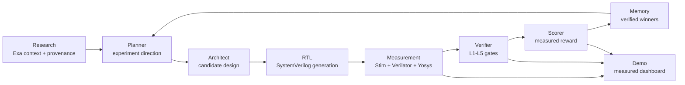

# CryoBrain

**The AI hardware lab for designing the full quantum chip, starting with the brain that keeps it alive.**

[](#status-at-a-glance)
[](docs/specs/SPEC-v6.1-checkpointed.md)
[](pyproject.toml)
[](web/README.md)
[](artifacts/measured_50_iteration_summary.json)

CryoBrain is a measured agentic hardware-design platform. Today it proves the loop on quantum-decoder and FIFO hardware targets: agents research, propose, generate RTL, simulate, synthesize, verify, score, remember, and improve against real artifacts. The bigger vision is full chip design: an AI lab that co-designs the decoder, dataflow, memory, control, verification, and cryogenic hardware stack for future quantum processors.

The pitch is simple: **every quantum chip needs a brain. CryoBrain is the swarm that designs that brain today, and the path to AI-designed full-chip systems tomorrow.**

## Contents

- [Why This Exists](#why-this-exists)
- [Status At A Glance](#status-at-a-glance)
- [What Is Built](#what-is-built)
- [Evidence](#evidence)
- [Architecture](#architecture)
- [Demo](#demo)
- [Quick Start](#quick-start)
- [Configuration](#configuration)
- [Repository Map](#repository-map)
- [Verification](#verification)
- [Built With](#built-with)
- [Roadmap](#roadmap)
- [Contributing Invariants](#contributing-invariants)
- [License](#license)

## Why This Exists

Quantum computers will not scale without real-time error correction. That means future chips need more than qubits: they need an on-chip intelligence layer that can interpret syndrome streams, choose corrections, respect cryogenic hardware budgets, and keep the machine alive.

Most AI hardware demos stop at generated code or proxy scores. CryoBrain is built around a stricter rule:

```text
worse RTL -> worse measured behavior -> lower reward
```

The system is useful only if a proposed design survives measurement and verification. That is why the repo is organized around measured artifacts, not screenshots or synthetic claims.

The current implementation is the slow design loop: an AI swarm improves hardware designs offline. The full-chip vision is the fast loop: the learned NPU-style brain eventually sits inside the quantum control stack and helps run the chip in real time. The README sells that full vision, while the status table below separates what is actually built from what remains the roadmap.

## Status At A Glance

| Area | Status | Evidence |
|------|--------|----------|
| Measured reward spine | Built and validated | `score_measured`, Stim vectors, Verilator, Yosys; C0-C10 gate passes |
| Quantum-decoder task | Built, early climb | `artifacts/measured_climb.json`; golden baseline is landed, multi-step decoder improvement is still limited |
| FIFO hardware target | Built, improving | 50/50 marathon iterations show positive FIFO throughput delta |
| 50 sponsor-backed marathon | Built and archived | `artifacts/marathon_runs/cycle_001` through `cycle_050`; summary in `artifacts/measured_50_iteration_summary.json` |
| Research adoption loop | Built | Exa research context is threaded into proposal/memory artifacts and the swarm event bus |
| Offline demo dashboard | Built | `demo/index.html`, generated from measured artifacts only |
| React/Three pitch site | Built on this branch | `web/`, a 14-section scrollytelling app bound to `web/public/data/cryobrain.json` |
| Memory A/B | Evidence present, no advantage claim | 50/50 iterations report `memory_parity`; `memory_wins=0` |
| Full chip design platform | Vision, partially proven by two hardware targets | Current proof covers decoder + FIFO; roadmap expands to broader chip subsystems |
| In-chip real-time NPU brain | Vision | Not claimed as built in this repo |

## What Is Built

CryoBrain is a nine-role hardware-design swarm:

| Role | Responsibility | Current implementation |
|------|----------------|------------------------|
| Research | Pull current decoder/QEC context and provenance | Exa-backed context packs |
| Planner | Choose the next experiment direction | Planner climb artifacts |
| Architect | Propose candidate decoder/NPU configurations | Fireworks-enabled proposer with deterministic fallback |
| RTL | Generate synthesizable SystemVerilog | `cryobrain/rtl_gen/` and task RTL outputs |
| Measurement | Run measured simulations and hardware metrics | Stim, Verilator, Yosys, FIFO throughput |
| Verifier | Enforce L1-L5 checks | Functional, accuracy, formal-when-available, synthesis, budget |
| Scorer | Convert measured behavior into reward | Measured-only reward path |
| Memory | Store verified winners and provenance | JSONL memory records and A/B evidence |
| Visualization | Render the audit trail | Offline dashboard bound to measured artifacts |

The core loop is:

```text
Research -> Planner -> Architect -> RTL -> Measurement -> Verifier -> Scorer -> Memory
            ^_______________________________________________________________|
```

The loop is intentionally not just "AI writes Verilog." It is an evidence machine: every useful claim should point at an artifact.

## Evidence

The strongest current proof is the sponsor-backed marathon:

| Evidence | Current value |
|----------|---------------|
| Completed iterations | 50 |
| Steps per agent per iteration | 2 |
| Archived iteration directories | 50 |
| Required live sponsors | HUD, Exa, Fireworks, Modal |
| FIFO iterations with positive throughput delta | 50 |
| Decoder iterations with positive delta | 0, because the decoder is already at the golden baseline in these runs |
| Memory iterations marked as wins | 0 |
| Memory status | `memory_parity` |
| Measured Pareto points | 26 total, 22 frontier points |

Key files:

- `artifacts/measured_50_iteration_summary.json` - top-level marathon summary.
- `artifacts/marathon_runs/cycle_001/` ... `cycle_050/` - archived measured evidence per iteration.
- `artifacts/measured_fifo_climb.json` - FIFO throughput improvement evidence.
- `artifacts/measured_climb.json` - decoder measured climb evidence.
- `artifacts/measured_memory_ab.json` - memory A/B artifact; currently parity, not advantage.
- `artifacts/measured_pareto.json` - measured design frontier.
- `artifacts/verification_report.json` - L1-L5 verification summary.

## Architecture



The measured reward path is the moat:

1. Generate a hardware candidate.
2. Run real simulation / measurement.
3. Reject invalid or over-budget designs.
4. Score only measured behavior.
5. Archive the result so the claim can be audited later.

The full-chip design vision extends this same loop beyond the current decoder/FIFO targets: interconnect, memories, control, calibration datapaths, verification plans, and eventually the on-chip NPU-style brain.

## Demo

There are two demo surfaces:

| Surface | Purpose | Path |
|---------|---------|------|
| React/Three scrollytelling site | Sells the full-chip vision with a polished visual narrative bound to measured project data | `web/` |
| Offline audit dashboard | Shows the raw measured loop: waveform, improvement tracks, memory A/B, Pareto, and swarm bus | `demo/index.html` |

### React/Three Vision Site

Run the richer pitch experience:

```powershell
cd .\web
npm install
npm run dev
```

Then open the local Vite URL: `http://127.0.0.1:5174/` or `http://localhost:5174/`.

Build the static site:

```powershell
cd .\web
npm run build
```

The web app uses `web/public/data/cryobrain.json` as its measured data contract. It presents the 2040 full-chip arc, but keeps measured numbers tied to the checked-in evidence.

### Offline Audit Dashboard

Open the offline dashboard:

```powershell
Invoke-Item .\demo\index.html
```

Recommended 2-minute flow:

1. Show the full-chip thesis: CryoBrain is the AI hardware lab for the chip's brain.
2. Start with the React/Three site for the vision and chip story.
3. Open `demo/index.html` and click **Play story** for the audit trail.
4. Point to Panel B for measured decoder/FIFO improvement tracks.
5. Point to the swarm bus: research, proposal, measurement, verification, scoring, memory.
6. Point to Panel C honestly: memory A/B exists, but current evidence is parity.
7. Point to the archived marathon summary for 50 sponsor-backed iterations.

If you need to rebuild the demo from artifacts:

```powershell
uv run python scripts/build_demo.py
uv run python scripts/check_demo_rehearsal.py
```

## Quick Start

### Windows / PowerShell

Prerequisites:

- Python 3.11 or 3.12
- `uv`
- WSL for the full EDA-backed path
- OSS CAD Suite inside WSL for Verilator/Yosys flows

Install Python dependencies:

```powershell
uv sync --extra rl --extra sponsors
```

Run the lightweight local checks:

```powershell
uv run pytest tests/test_demo_measured.py tests/test_marathon_iterations.py -q
uv run python scripts/check_spec_v61_checkpoints.py
uv run python scripts/check_demo_rehearsal.py
```

Run the React/Three site:

```powershell
cd .\web
npm install
npm run dev
```

### WSL / EDA Path

Install the OSS CAD Suite if needed:

```bash
bash scripts/install_oss_cad_wsl.sh
```

Run the full SPEC-v6.1 gate:

```bash
bash scripts/run_spec_v6_gate_wsl.sh
```

Run or validate the sponsor-backed marathon:

```bash
bash scripts/run_improvement_marathon_wsl.sh 50 2 0 50
python scripts/check_marathon_iterations.py --min-iterations 50 --require-sponsors --require-artifacts
```

## Configuration

Create a local `.env` for private keys. Do not commit it.

| Variable | Purpose |
|----------|---------|
| `HUD_API_KEY` | HUD evaluation/runtime access |
| `EXA_API_KEY` | Research context retrieval |
| `FIREWORKS_API_KEY` | Architect/Planner proposal generation |
| `MODAL_TOKEN_ID` | Modal remote measurement credential |
| `MODAL_TOKEN_SECRET` | Modal remote measurement credential |
| `MODAL_TOML` | Optional path override for Modal config; defaults to `$HOME/.modal.toml` in WSL wrappers |

Sponsor readiness check:

```powershell
uv run python scripts/check_sponsors.py --require-core
```

## Repository Map

| Path | Role |
|------|------|
| `env.py` | HUD environment and agent tools |
| `tasks.py`, `task_catalog.py`, `grader.py` | HUD task registration and hidden grader routing |
| `cryobrain/rl/` | Measured training, FIFO loop, planner loop, Modal measurement integration |
| `cryobrain/swarm/` | Event bus, executors, proposal loop, visualization data |
| `cryobrain/retrieval/` | Research context packs and provenance tags |
| `cryobrain/rtl_gen/` | SystemVerilog generation |
| `cryobrain/verify/` | L1-L5 verification logic |
| `cryobrain/artifacts/` | Artifact builders, Pareto/frontier support, reports |
| `tasks/cryo_brain_decoder/` | Primary quantum-decoder hardware task |
| `tasks/stream_arb_fifo_*` | FIFO repair/DV/formal tracks used as a broader hardware proof point |
| `scripts/` | Checkpoint, marathon, WSL, demo, and export commands |
| `demo/` | Offline measured dashboard |
| `web/` | React/Vite/Three scrollytelling site for the full-chip vision |
| `docs/specs/` | Versioned specs; SPEC-v6.1 is the current checkpointed spec |
| `artifacts/marathon_runs/` | Archived 50-iteration sponsor-backed evidence |

## Verification

Commands last used for the merged evidence path:

```powershell
uv run pytest tests/test_marathon_iterations.py tests/test_demo_measured.py tests/test_modal_measure.py tests/test_fireworks_proposer.py tests/test_exa_integration.py -q
uv run python scripts/check_marathon_iterations.py --min-iterations 50 --require-sponsors --require-artifacts
uv run python scripts/check_spec_v61_checkpoints.py
uv run python scripts/check_demo_rehearsal.py
```

React/Three app:

```powershell
cd .\web
npm run build
```

WSL syntax check for the sponsor wrappers:

```powershell
wsl.exe --cd /mnt/c/path/to/CryoBrain bash -n scripts/run_improvement_marathon_wsl.sh scripts/run_spec_v6_gate_wsl.sh
```

The full 50-iteration run was executed with:

```powershell
wsl.exe --cd /mnt/c/path/to/CryoBrain bash scripts/run_improvement_marathon_wsl.sh 50 2 0 50
```

## Built With

- Python 3.11-3.12
- uv
- HUD
- Stim
- PyMatching
- Verilator
- Yosys
- Cocotb / PyUVM
- Modal
- Fireworks
- Exa
- Pytest
- WSL
- HTML, CSS, and JavaScript for the offline demo
- React 18
- Vite 5
- TypeScript
- Three.js / React Three Fiber

## Roadmap

The roadmap is full chip design, not only decoder tuning.

| Horizon | Goal |
|---------|------|
| Next | Push decoder beyond the golden baseline with multi-step L2-valid improvements |
| Next | Turn memory A/B from parity into measured advantage before claiming compounding |
| Near | Add richer chip subsystems: memory hierarchy, routing/dataflow, calibration control, and scheduler logic |
| Near | Expand verification from per-block evidence to cross-block chip-level contracts |
| Long | Train the design swarm across the complete cryogenic control stack |
| Long | Move from offline chip-design lab to an in-chip NPU-style brain that can support real-time QEC decisions |

## Contributing Invariants

Keep these rules intact:

- Do not replace measured reward with proxy-only scoring.
- Do not present a generated design as useful until measurement and verification artifacts exist.
- Do not claim memory advantage unless `endpoint_delta > 0` in measured A/B evidence.
- Keep sponsor keys and local credential paths out of committed artifacts.
- Keep roadmap/full-chip claims clearly separated from built evidence.
- Preserve PowerShell-safe commands for Windows users and label WSL commands clearly.

## License

No root `LICENSE` file is currently checked in. Do not assume the repository is MIT-licensed until a root license is added.

Third-party HDL notices are documented in `THIRD_PARTY_NOTICES.md`. Vendored BaseJump STL files under `tasks/stream_arb_fifo_*` preserve their upstream Solderpad Hardware License notices.
